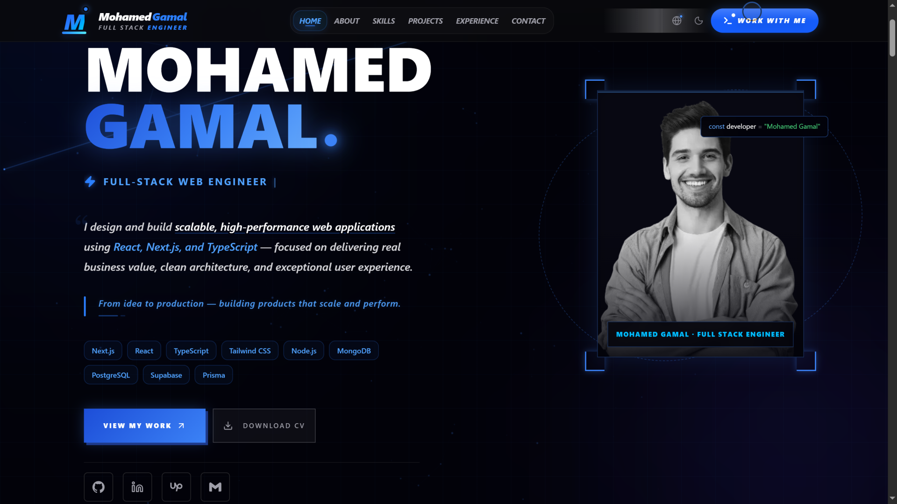
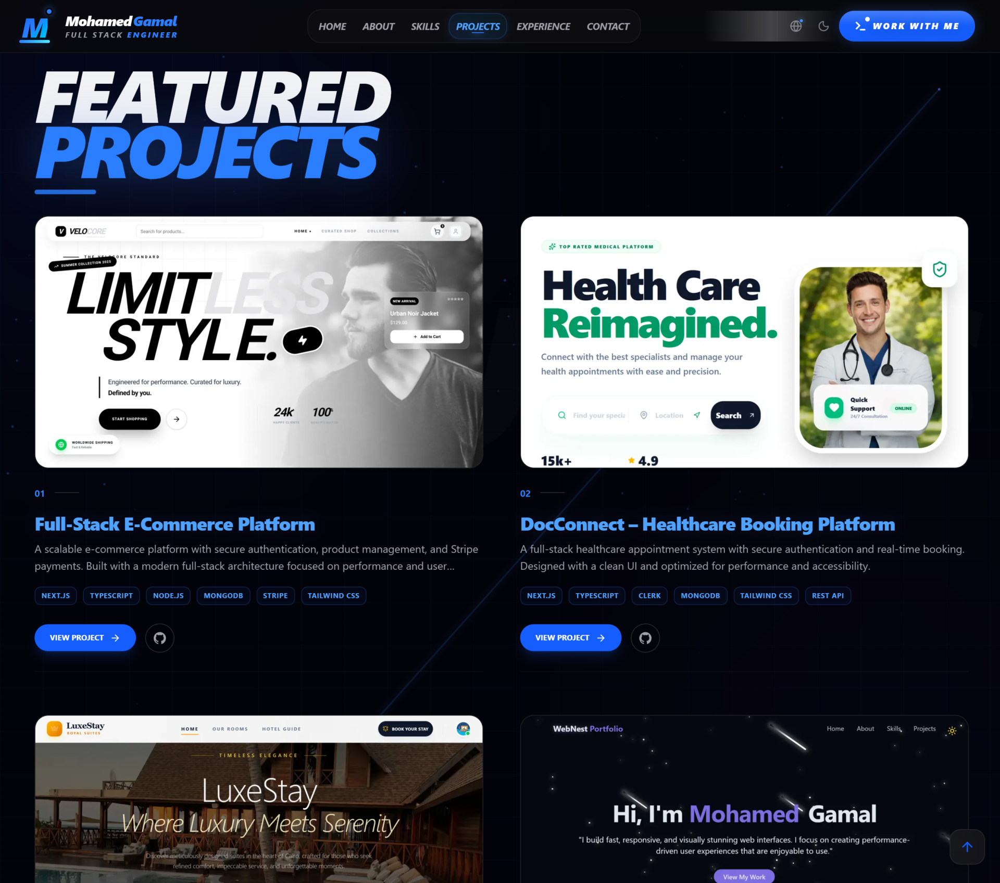
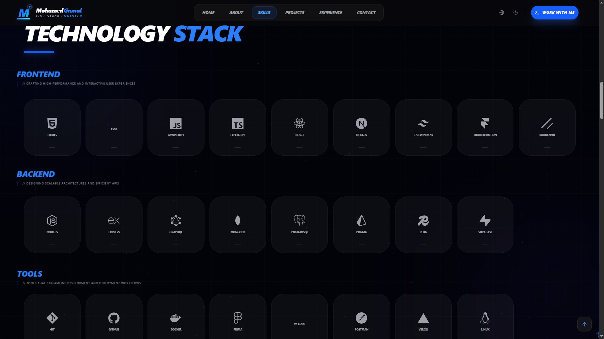
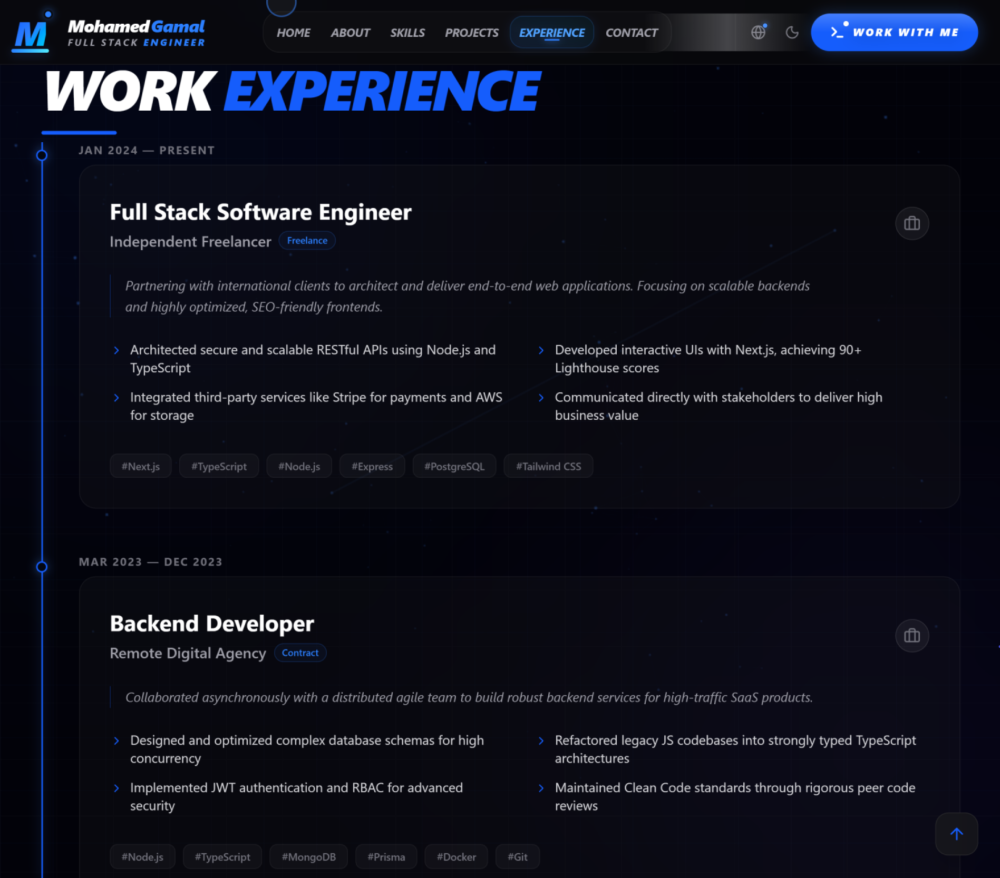
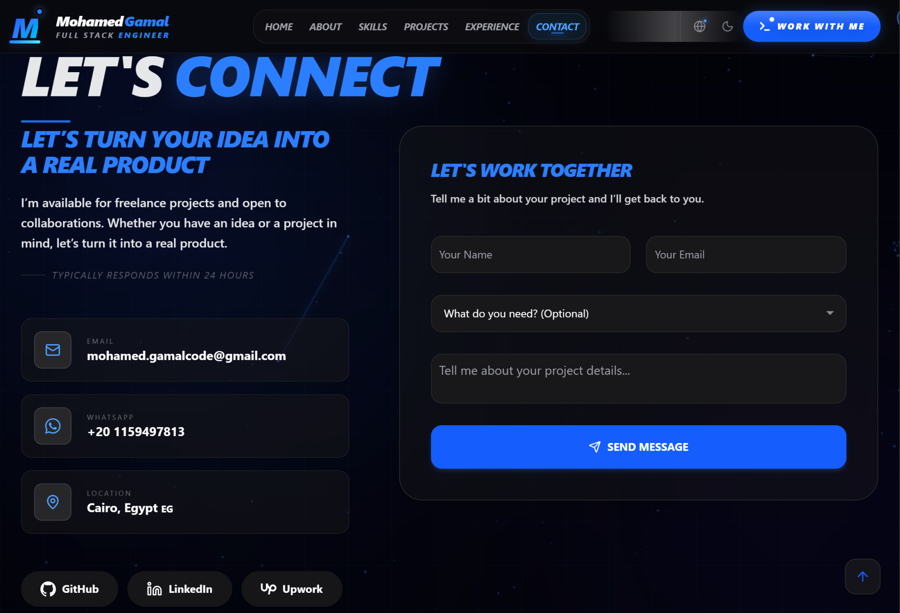

<!-- @format -->

<div align="center">

# Mohamed Gamal — Full Stack Engineer

### Crafting fast, scalable, and user-focused web experiences with modern technologies

<p align="center">
  <a href="https://mohamedgamal-portfolio.vercel.app/">
    
  </a>
  <a href="https://github.com/mohamedgamal-code/mohamed-gamal-portfolio">
    
  </a>
</p>

[](https://nextjs.org)
[](https://typescriptlang.org)
[](https://tailwindcss.com)
[](https://framer.com/motion)

</div>

---

## 💡 About This Project

This is a modern, high-performance portfolio built to showcase my work, skills, and experience as a Full Stack Developer.

The project focuses on clean architecture, scalability, and a refined user experience, combining smooth animations with a fully responsive and accessible design.

It also supports multilingual experiences (English & Arabic), including RTL and LTR layouts, ensuring a seamless experience for a wider audience.
<p align="center">
  Built with attention to detail and a passion for clean, modern UI.
</p>

---

## 🖼️ Screenshots

<div align="center">

### 🏠 Home

<p align="center">
  
</p>

### 💼 Projects

<p align="center">
  
</p>
### 🛠️ Skills

<p align="center">
  
</p>

### 🧠 Experience

<p align="center">
  
</p>

### 📬 Contact
<p align="center">
  
</p>

---

</div>

## ✨ Features

| Feature                   | Description                                             |
| ------------------------- | ------------------------------------------------------- |
| ⚡ **Next.js 15**         | App Router, Server Components, optimized performance    |
| 🌍 **Full i18n**          | English (LTR) & Arabic (RTL) with `next-intl`           |
| 🎨 **Animations**         | Particles, Lightning effects, Framer Motion transitions |
| 📱 **Responsive**         | Mobile-first, optimized for all screen sizes            |
| 🌙 **Dark / Light**       | Smooth theme switching with `next-themes`               |
| 🚀 **Performance**        | Optimized for speed (Lighthouse 90+)                    |
| 🏗️ **Clean Architecture** | Modular structure, separation of concerns               |
| 🔍 **SEO Ready**          | OpenGraph, Twitter Card, structured metadata            |

---

## 🛠️ Tech Stack

<p align="center">
  
</p>

---

## 📂 Project Structure

```
src/
├── app/
│   └── [locale]/        # EN / AR routes
├── components/
│   ├── animations/      # Particles, Lightning, FadeIn
│   ├── constants/       # Data (projects, skills, experience)
│   ├── layout/          # Navbar, Footer
│   ├── providers/       # ThemeProvider
│   ├── sections/        # Hero, About, Skills, Projects...
│   └── ui/              # shadcn components
├── i18n/                # next-intl config & routing
├── lib/                 # Utility functions
└── messages/            # ar.json, en.json
public/
├── avatar.png           # Profile image
├── cv.pdf               # Downloadable CV
├── og.png               # OpenGraph image
├── projects/            # Project screenshots
└── screenshots/         # README screenshots
```

---

## 🚀 Getting Started

```bash
# Clone the repository
git clone https://github.com/mohamedgamal-code/mohamed-gamal-portfolio
cd your-repo

# Install dependencies
npm install

# Run development server
npm run dev

# Build for production
npm run build
```

Open [http://localhost:3000](http://localhost:3000) in your browser.

---

## 🌍 i18n Setup

The portfolio supports **English** and **Arabic** out of the box.

```
/en  →  English (LTR)
/ar  →  Arabic  (RTL)
```

Translation files are located in `src/messages/`:

- `en.json` — English translations
- `ar.json` — Arabic translations

---

## 📬 Contact

<div align="center">

<a href="https://mohamedgamal-portfolio.vercel.app/">
  
</a>

<a href="https://www.linkedin.com/in/mohamed-gamal-code">
  
</a>

<a href="https://github.com/mohamedgamal-code">
  
</a>

<a href="https://www.upwork.com/freelancers/~0194a7d28b23a1525f">
  
</a>

</div>

---

## 📄 License

This project is licensed under the [MIT License](LICENSE).

<br />

<div align="center">

### 💫 Final Note

_Crafted with attention to detail, performance, and modern web technologies._

<br/>

**If you found this project helpful, consider giving it a ⭐ to support the work.**

<br/>

Made with ❤️ by [Mohamed Gamal](https://github.com/mohamedgamal-code)

</div>
