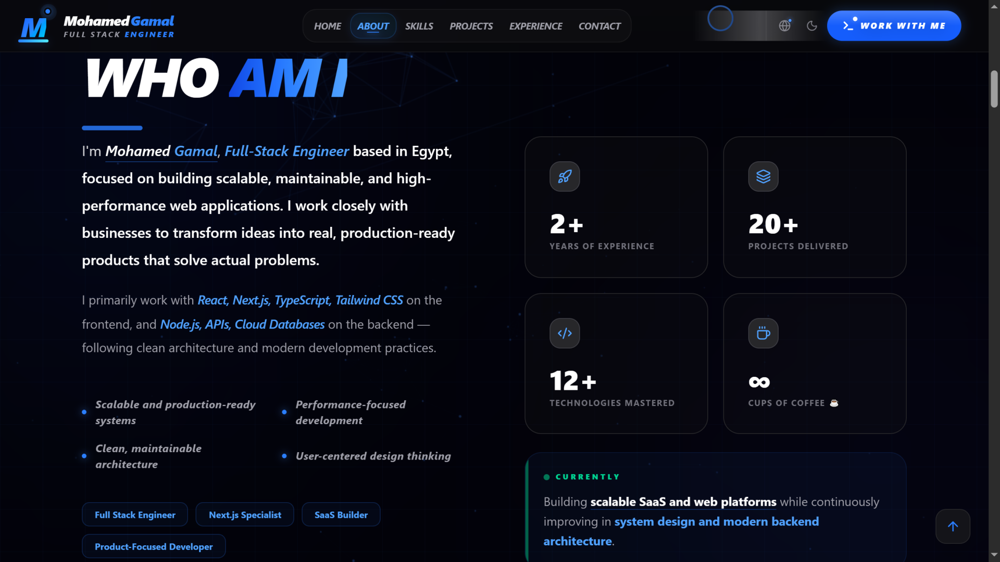

<div align="center">

# Ahmed Ali — Full Stack Engineer

### Crafting fast, scalable, and user-focused web experiences

<p align="center">
  <a href="https://your-domain.vercel.app">
    
  </a>
  <a href="https://github.com/your-username/your-repo">
    
  </a>
</p>

[](https://nextjs.org)
[](https://typescriptlang.org)
[](https://tailwindcss.com)
[](https://framer.com/motion)

</div>

---

## 💡 About This Project

This portfolio is designed to showcase my work, skills, and experience as a Full Stack Engineer.  
It focuses on performance, scalability, and modern UI/UX principles while supporting multilingual experiences (English & Arabic).

---

## 🖼️ Screenshots

<div align="center">

### 🏠 Home


### 👤 About


### 🛠️ Skills


### 💼 Projects


### 🧠 Experience


### 📬 Contact


</div>

---

## ✨ Features

| Feature | Description |
|---|---|
| ⚡ **Next.js 15** | App Router, Server Components, optimized performance |
| 🌍 **Full i18n** | English (LTR) & Arabic (RTL) with `next-intl` |
| 🎨 **Animations** | Particles, Lightning effects, Framer Motion transitions |
| 📱 **Responsive** | Mobile-first, optimized for all screen sizes |
| 🌙 **Dark / Light** | Smooth theme switching with `next-themes` |
| 🚀 **Performance** | Optimized for speed (Lighthouse 90+) |
| 🏗️ **Clean Architecture** | Modular structure, separation of concerns |
| 🔍 **SEO Ready** | OpenGraph, Twitter Card, structured metadata |

---

## 🛠️ Tech Stack

### 🎨 Frontend
- Next.js 15 · TypeScript · Tailwind CSS v4  
- Framer Motion · shadcn/ui · Radix UI · next-intl  

### ⚙️ Backend & Database
- Node.js · Express.js  
- MongoDB · PostgreSQL · Prisma  

---

## 📂 Project Structure


```
src/
├── app/
│   └── [locale]/        # EN / AR routes
├── components/
│   ├── animations/      # Particles, Lightning, FadeIn
│   ├── constants/       # Data (projects, skills, experience)
│   ├── layout/          # Navbar, Footer
│   ├── providers/       # ThemeProvider
│   ├── sections/        # Hero, About, Skills, Projects...
│   └── ui/              # shadcn components
├── i18n/                # next-intl config & routing
├── lib/                 # Utility functions
└── messages/            # ar.json, en.json
public/
├── avatar.png           # Profile image
├── cv.pdf               # Downloadable CV
├── og.png               # OpenGraph image
├── projects/            # Project screenshots
└── screenshots/         # README screenshots
```

---

## 🚀 Getting Started

```bash
# Clone the repository
git clone https://github.com/your-username/your-repo.git
cd your-repo

# Install dependencies
npm install

# Run development server
npm run dev

# Build for production
npm run build
```

Open [http://localhost:3000](http://localhost:3000) in your browser.

---

## 🌍 i18n Setup

The portfolio supports **English** and **Arabic** out of the box.

```
/en  →  English (LTR)
/ar  →  Arabic  (RTL)
```

Translation files are located in `src/messages/`:
- `en.json` — English translations
- `ar.json` — Arabic translations

---

## 📬 Contact

<div align="center">

| Platform | Link |
|---|---|
| 📧 Email | [your@email.com](mailto:your@email.com) |
| 💼 LinkedIn | [linkedin.com/in/your-profile](https://linkedin.com/in/your-profile) |
| 💻 GitHub | [github.com/your-username](https://github.com/your-username) |
| 💬 WhatsApp | [wa.me/your-number](https://wa.me/your-number) |

</div>

---

## 📄 License

This project is licensed under the [MIT License](LICENSE).

<br />

<div align="center">

### 💫 Final Note
*Built with passion, precision, and modern web technologies.*

**If you found this project useful, consider giving it a ⭐**

Made with ❤️ by [Ahmed Ali](https://github.com/your-username)

</div>